+++
date = '2026-03-13T19:22:07-07:00'
draft = true
title = 'Practica1: Cola de impresion en Lenguaje C'
+++
# <center> Practica 1: Cola de impresion en Lenguaje C </center>
## Introducción: 
En esta practica implementamos colas en lenguaje C de dos diferentes maneras, con memoria estatica y con memoria dinamica. El uso de colas nos permite gestionar datos en un orden secuencial, de modo que el primer dato que entra, es el primer dato en salir. Son excelentes para manejar recursos, evitar bloqueos y optimizar tiempos de espera.

## Diseño:
* En el primer codigo se utlizo una cola de memoria estatica; como su nombre lo dice, el tamaño de esta estructura es fijo y se define al inicio. Utilizamos indices para saber donde inicia y donde termina la cola
* En el segundo y tercero, utilizamos memoria dinamica. Aqui la cola esta conformada por nodos, que contienen la informacion y un puntero al siguiente nodo
eme

| Cola Estatica | Cola Dinamica |
| - | - |
| Usa arrays | Usa lista enlazada basada en nodos |
| Se reserva un bloque de memoria fijo al incio | Se solicita memoria conforme se neceista |
| `front` y `rear` son indices enteros | `head` y `tail` son direcciones de memoria |
| Limites impuestos al desarrollar el programa | Limitada por la capacidad de la ram |
| Solo utiliza memoria para el array | Necesita mas memoria para almacenar punteros `next` |

### Diseño del primer programa
```c
typedef struct printq
{
    int id;
    char usuario[MAX_USER];
    char documento[MAX_DOC];
    int paginas_total;
    Prioridad_t prioridad;
} PrintJob_t;

typedef struct
{
    PrintJob_t data[MAX_JOBS];
    int size;
} QueueStatic_t;
```
#### PrintJob_t:
* `int id`: Es el dato clave de la estructura, es asignado en base al numero de trabajo agreado (es decir el primero 1, segundo 2... el id no disminuye aunque se carguen trabajos)
* `char usuario[MAX_USER]`: Es el nombre del usuario
* `char documento[MAX_DOC]`: Es el nombre del documento
* `int paginas_totales`: Simplemente marca el numero de paginas, poco relevante en este codigo
* `Prioridad_t prioridad`: Marca si es 0 = NORMAL o 1 = URGENTE, toma mas relevancia en los siguientes codigos

#### QueueStatic_t:
* `PrintJob_t data[MAX_JOBS]`: Crea el arreglo de trabajos que vamos a guardar
* `int size`: Marca la cantidad de elementos en el arreglo
  
### Diseño del segundo programa
```c
typedef struct printq
{
    int id;
    char usuario[MAX_USER];
    char documento[MAX_DOC];
    int paginas_total;
    Prioridad_t prioridad;
} PrintJob_t;

typedef struct Node_t
{
    PrintJob_t job;
    struct Node_t *next;
} Node_t;

typedef struct
{
    struct Node_t *head;
    struct Node_t *tail;
    int size;
} QueueDynamic_t;
```
#### PrintJob_t:
* Queda igual que el anterior
#### Node_t:
* Es la donde vamos a guardar la informacion de cada elemento
* `PrintJob_t job`: Variable que contiene la informacion del elemento
* `struct Node_t *next`: Apuntador al siguiente elemnto
#### QueueDynamic_t:
* Estructura que nos ayuda a indicar donde estan nuestros elementos, ademas de cual es su tamaño
* Remplazo de QueueStatic_t
* `struct Node_t *head`: Apuntador al primer elemento de la lista
* `struct Node_t *tail`: Apuntador al ultimo elemento de la lista
* `int size`: Marca la cantidad de elementos en el arreglo

### Tercer codigo
```c
typedef enum
{
    EN_COLA = 0,
    IMPRIMIENDO = 1,
    COMPLETADO = 2,
    CANCELADO = 3
} Estado_t;

typedef struct printq
{
    int id;
    char usuario[MAX_USER];
    char documento[MAX_DOC];
    int paginas_total;
    int paginas_restantes;
    Prioridad_t prioridad;
    Estado_t estado;
} PrintJob_t;

typedef struct Node_t
{
    PrintJob_t job;
    struct Node_t *next;
} Node_t;

typedef struct
{
    struct Node_t *head;
    struct Node_t *tail;
    int size;
} QueueDynamic_t;
```
#### Estado_t:
* Lo utilizamos para marcar que es lo que esta realizando cada nodo
#### PrintJob_t
* Se agrego `estado` y `paginas_restantes`
* `Estado_t estado`: Indica que esta realizando el nodo
* `paginas_restantes`: Lo utilizamos en la simulacion para saber imprimir cuantas paginas faltan
#### Node_t:
* Queda igual que el anterior
#### QueueDynamic_t:
* Queda igual que el anterior
  
## Implementacion
Antes de ir a la propia implementacion del codigo, cabe mencionar que se utilizo una libreria propia, esta libreria es reutilizada del semestre anterior de la clase **Programacion Estructurada** la libreria se llama *"zazueta.h"*, tiene como proposito la validacion de entradas, se utilizo la `my_gets(cadena, size)` que, en escencia es fgets() pero con sus respectivas validaciones, ademas de `val_int(ri, rf, cadena)` que sirve para validar numeros enteros, por las especficacione de la practica solo se implemento en el menu.

### Primer codigo
```c
void menu();
int msgs();
void qs_init(QueueStatic_t *q);
int qs_is_empty(const QueueStatic_t q);
int qs_is_full(const QueueStatic_t q);
int qs_enqueue(QueueStatic_t *q, PrintJob_t job);
int qs_peek(QueueStatic_t *q, PrintJob_t *out);
int qs_dequeue(QueueStatic_t *q, PrintJob_t *out);
void qs_print(const QueueStatic_t *q);
```
* `void qs_init(QueueStatic_t *q)`
Inicializa la cola estableciendo su campo `size` en `0`. Debe llamarse obligatoriamente antes de usar cualquier otra función sobre la cola.

* `int qs_is_empty(const QueueStatic_t q)`
Verifica si la cola está vacia. Retorna `1` si no contiene elementos, `0` en caso contrario.
* `int qs_is_full(const QueueStatic_t q)`
Verifica si la cola está llena, comparando `size` contra el límite `MAX_JOBS`. Retorna `1` si alcanzó la capacidad máxima, `0` si aún hay espacio disponible.
* `int qs_enqueue(QueueStatic_t *q, PrintJob_t job)`
Agrega un nuevo trabajo de impresión al final de la cola. Si la cola está llena retorna `0` (fallo); inserta `job` en `data[size]`, incrementa `size` y retorna `1` (exito).
* `int qs_peek(QueueStatic_t *q, PrintJob_t *out)`
Consulta el trabajo al frente de la cola sin eliminarlo, copiándolo en `*out`. Retorna `0` en ambos casos (cola vacía o lectura exitosa).

* `int qs_dequeue(QueueStatic_t *q, PrintJob_t *out)`
Extrae el trabajo del frente de la cola. Si está vacía retorna `0`; de lo contrario copia el primer elemento en `*out`, desplaza los elementos restantes una posición hacia adelante, decrementa `size` y retorna `1` (éxito).

* `void qs_print(const QueueStatic_t *q)`
Imprime en consola todos los trabajos actuales de la cola con el formato:
*  * ```
        [id = <id>, user = <usuario>, doc = <documento>, pags = <paginas_total>, prioridad = URGENTE|NORMAL] ```
* * Limpia la pantalla antes con `system("CLS")` y pausa la ejecución al finalizar con `system("PAUSE")`.

### Segundo codigo
```c
void qd_init(QueueDynamic_t *q);
Node_t *create_node(int id);
int qd_is_empty(const QueueDynamic_t q);
int qd_enqueue(QueueDynamic_t *q, int id);
int qd_peek(QueueDynamic_t *q, Node_t **out);
int qd_dequeue(QueueDynamic_t *q, Node_t **out);
void qd_print(QueueDynamic_t *q);
void qd_destroy(QueueDynamic_t *q);

```
* `void qd_init(QueueDynamic_t *q)`
Comportamiento casi identico a `qs_init`, con la diferencia de que también inicializa los punteros `head` y `tail` en `NULL`.

* `Node_t *create_node(int id)`
Crea y retorna un nuevo nodo con memoria asignada dinamicamente (`malloc`). Solicita al usuario los datos del trabajo: `usuario`, `documento`, `paginas_total` y `prioridad`. Si la asignación falla retorna `NULL`, en caso exitoso retorna el puntero al nuevo nodo con `next = NULL`.

* `int qd_is_empty(const QueueDynamic_t q)`
Idéntica a `qs_is_empty`, solo cambia el tipo de cola que recibe.

* `int qd_enqueue(QueueDynamic_t *q, int id)`
Similar a `qs_enqueue`, con las siguientes diferencias:
  * Recibe un `id` en lugar de un `PrintJob_t` completo, y crea el nodo internamente con `create_node`.
  * Si el nodo no pudo crearse retorna `0`.
  * Si la cola está vacía, asigna el nuevo nodo tanto a `head` como a `tail`.
  * En caso contrario, enlaza el nodo al final mediante `tail->next` y actualiza `tail`.

* `int qd_peek(QueueDynamic_t *q, Node_t **out)`
Similar a `qs_peek`, con la diferencia de que `*out` es un puntero a `Node_t` en lugar de una copia del job. Retorna `1` en caso exitoso (corrigiendo la inconsistencia de la versión estática).

* `int qd_dequeue(QueueDynamic_t *q, Node_t **out)`
  Similar a `qs_dequeue`, con las siguientes diferencias:
  * `*out` recibe un puntero al nodo extraído en lugar de una copia.
  * No realiza desplazamiento de elementos; simplemente avanza `head` al siguiente nodo con `head = head->next`.

* `void qd_print(QueueDynamic_t *q)`
Comportamiento idéntico a `qs_print`, con la diferencia de que recorre la cola siguiendo punteros `actual->next` en lugar de índices. Adicionalmente imprime la dirección de memoria de cada nodo con `(%p)`.

* `void qd_destroy(QueueDynamic_t *q)`
Función exclusiva de la cola dinámica. Recorre todos los nodos liberando su memoria con `free`, y al finalizar restablece `head`, `tail` a `NULL` y `size` a `0`.

### Tercer codigo

* `Node_t *create_node(int id)`
  Crea y retorna un nuevo nodo con memoria asignada dinámicamente (`malloc`). Solicita al usuario los datos del trabajo: `usuario`, `documento`, `paginas_total` y `prioridad`. Adicionalmente inicializa `paginas_restantes` con el valor de `paginas_total` y establece el `estado` en `EN_COLA`. Si la asignación falla retorna `NULL`, en caso exitoso retorna el puntero al nuevo nodo con `next = NULL`.

* `int qd_is_empty(const QueueDynamic_t q)`
  Idéntica a `qs_is_empty`, solo cambia el tipo de cola que recibe.

* `int qd_enqueue(QueueDynamic_t *q, int id)`
  Similar a la versión anterior, con la diferencia de que ahora maneja prioridad al insertar:
  * Si el job es `URGENTE`, se inserta al **frente** de la cola actualizando `head`.
  * Si es `NORMAL`, se inserta al **final** actualizando `tail`.
  
* `void qd_sim(QueueDynamic_t *q)`
  Simula el proceso de impresión desencolando uno a uno los trabajos:
  * Cambia el `estado` del job a `IMPRIMIENDO` y decrementa `paginas_restantes` en cada iteración, con una pausa de `MS_PER_PAG` milisegundos entre páginas.
  * Al terminar, cambia el `estado` a `COMPLETADO`, libera el nodo con `free` y continúa con el siguiente.

* `int qd_cancel(QueueDynamic_t *q, int id)`
  Busca y elimina el nodo con el `id` indicado:
  * Si el nodo a eliminar es el primero, actualiza `head` y si la cola queda vacía también limpia `tail`.
  * Si se encuentra en otra posición, reenlaza el nodo anterior con el siguiente y actualiza `tail` si el eliminado era el último.
  * Retorna `1` si se eliminó correctamente, `0` si la cola está vacía o no se encontró el `id`.

## Demostracion de conceptos
* **Alcance y duracion de las variables**: En todo el progragrama se trabajan unicamente con variables locales y punteros, ¿Cual es la razon de esto? Se debe a que asi es la forma en la que creo que es correcta su implementacion y asi es como lo he trabajado. recapacitando pude haber utilizado una variable `static int` para guardar el id sin embargo creo que la forma en la que lo aplique tambien es correcta.
* **Memoria**: 
  * Stack: Las variables locales, parametros de funciones y estructuras pasadas por valor (como `const QueueStatic_t q`) se alojan automáticamente en el stack. En la cola estática, el arreglo `data[MAX_JOBS]` también vive en el stack al ser de tamaño fijo en tiempo de compilación.
  * Heap: Toda la memoria de la cola dinamica se gestiona en el heap. Cada nodo `Node_t` es creado con `malloc` dentro de `create_node`, por lo que su tiempo de vida no está atado al scope de ninguna funcion.
  * Donde se libera: La memoria se maneja de manera explicita en `qd_destroy`, `qd_sim`, `qd_cancel` y `qs_dequeue`
* **Subprogramas**: Algunas funciones reciben punteros debido a que necesitamos modificar los datos que estan dentro de ellas, y las que estan como const no es necesario modificarlas
* **Tipos de datos**: Los typdef struct se utilizaron para almacenar distitos tipos de variables en un mismo indenticador, las variables se relacionan de cierta manera. Los typedef enum los utilizamos para una mejor legibilidad del codigo.

## Simulacion
### Codigo 2
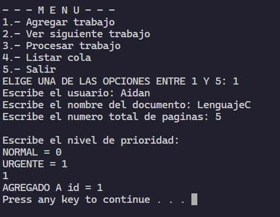

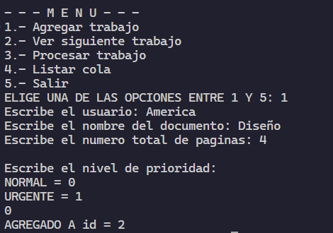

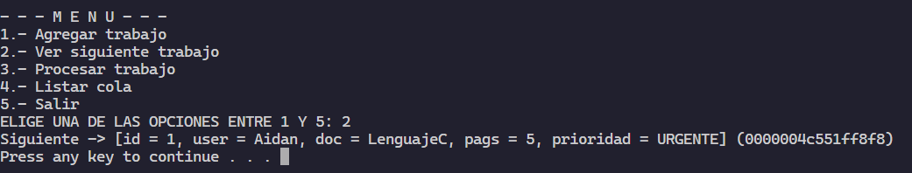

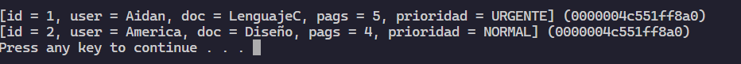

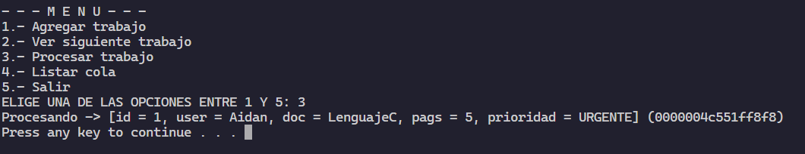
### Codigo 3
La implementacion del delay por ms se logro con la libreria <window.h>, con ella utilizamos la funcion `Sleep(ms)`
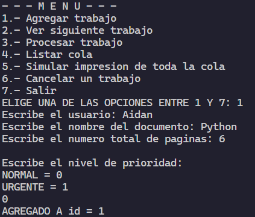

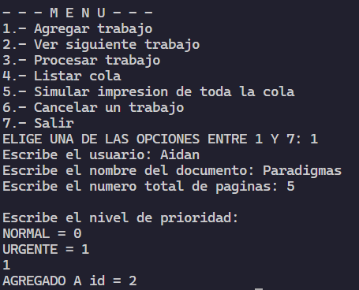

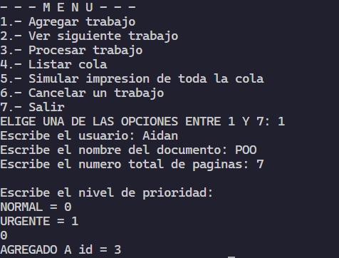

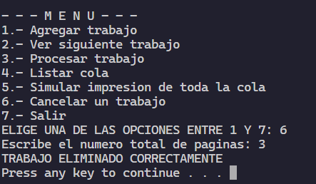

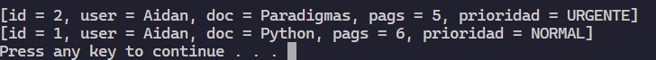

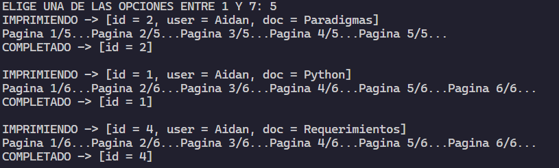

## Conclusion
En lo personal puedo decir que me gusto mucho esta practica, refuerza bastantes de los conocimientos que aprendimos en la materia de Estructuras de Datos, y de hecho creo que los aplico mejor en esta practica. Como critica personal me quedo claro que no debo dejar las practica para el ultimo dia, creo que pude haber puesto mas atencion al detalle si lo hubiera realizado con calma.