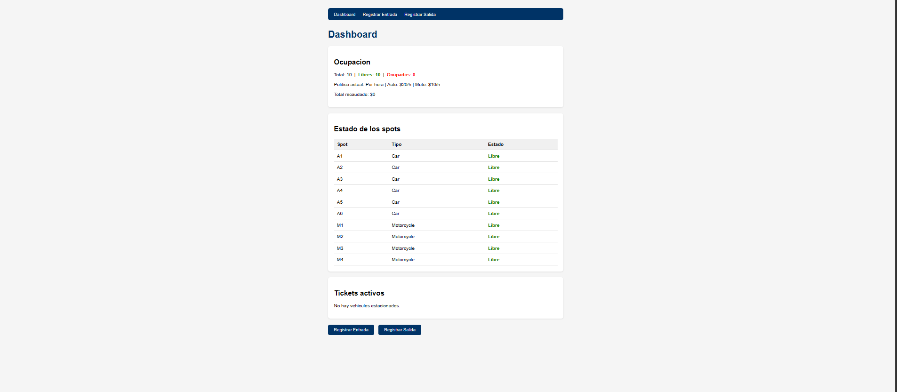
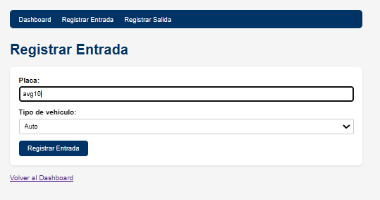
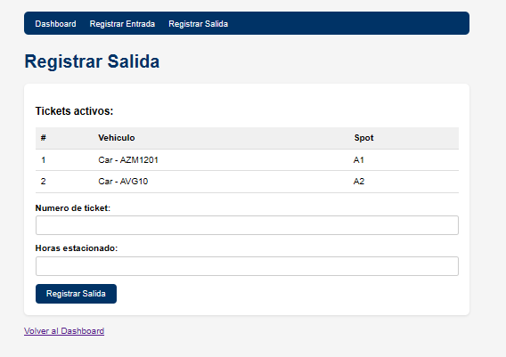
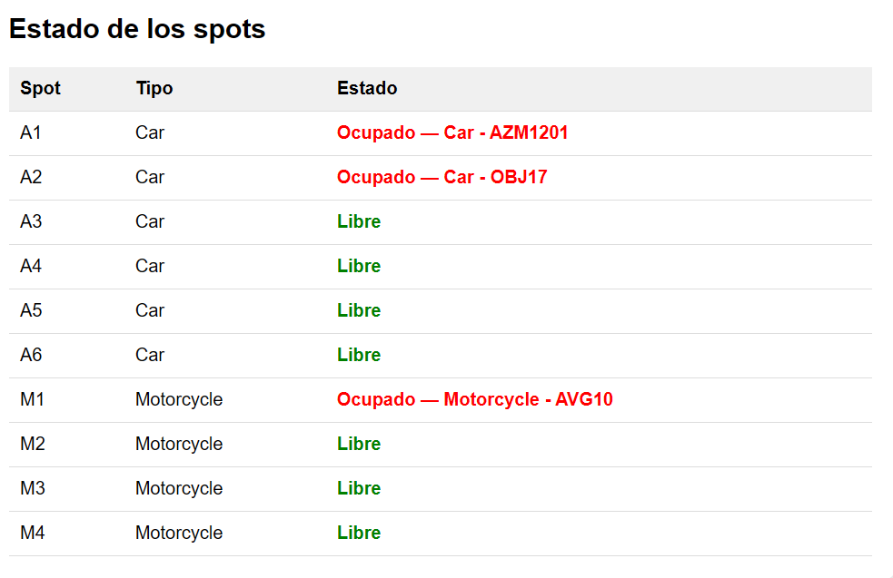
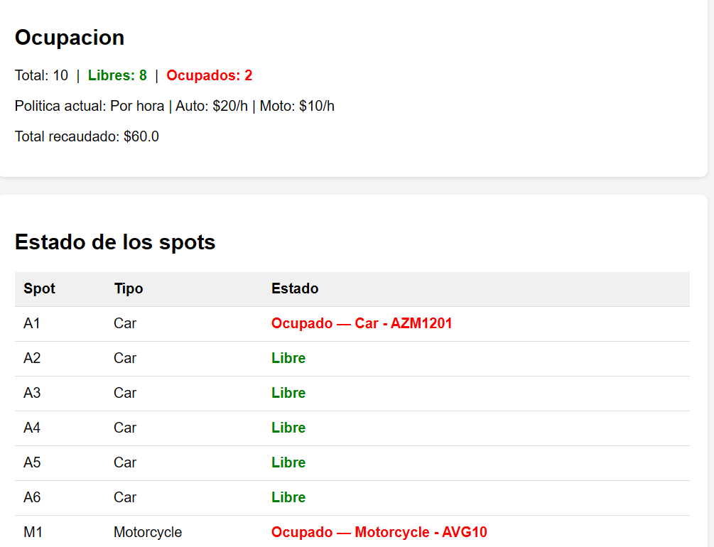
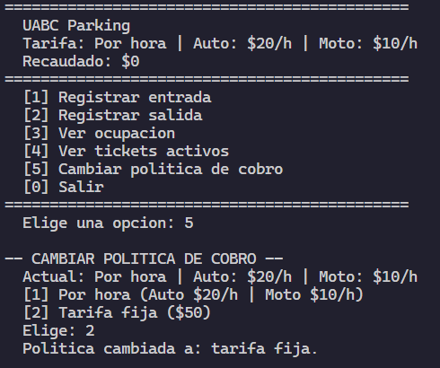
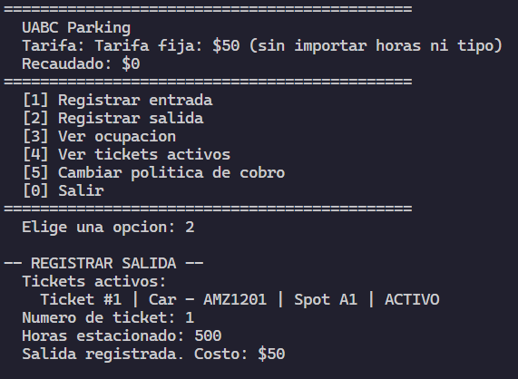

+++
date = '2026-03-28T22:45:01-07:00'
draft = false
title = 'Practica3'
+++ <br>
**Universidad Autonoma de Baja California** <br>
**Materia**: Paradigmas de la programacion <br>
**Docente**: Jose Carlos Gallegos Mariscal <br>
**Alumno**: Zazueta Medrano Aidan <br>
**Matricula**: 379479
# <center>Practica 2: Programacion Orientada a Objetos (simulación de sistema de estacionamiento)</center>

## Introducción:
En esta práctica desarrollamos una simulación de un sistema de estacionamiento aplicando conocimientos del paradigma de Programacion Orientado a Objetos. Es un sistema sencillo en el que permite marcar entradas y salidas de vehiculos, calcular el cobro segun el tiempo que hayan estado y consultar cual es el estado del estacionamiento.

> Nota: *Gran parte del codigo esta implentado con IA (claude) debido al poco conocimiento que tengo en este momento acerca de POO en python, la intencion de la practica es conocer los principos y bases de POO, seran explicadas en este reporte*

## Modelo del dominio
### Clases y sus responsabilidades
| Clases | Responsabilidad|
| --- | --- |
| Vehicle | Clase base para vehiculos, tiene placa y tipo (carro o moto) |
| Car | Herada de Vehicle |
| Motorcycle | Herada de Vehicle |
| ParkingSpot | Representa un lugar fisico del estacionamiento |
| Ticket | Registra la estancia de un vehiculo |
| RatePolicy | Clase base para las politicas de cobro |
| HourlyRatePolicy | Calcula costo por hora segun tipo de vehiculo |
| FlatRatePolicy | Calcula un costo fijo sin importar horas ni tipo |
| ParkingLot | Administra spots, tickets y la politica de cobro |

## Evidencia de conceptos

### Encapsulación
En el siguiente fragmento de codigo, podemos observar que los atributos de las clases son privados (utilizamos doble guion bajo '__' para marcar que son privados) y que su modificacion solo es con metodos,
```python
# Fragmento de codigo de Spot.py
class ParkingSpot:
    def __init__(self, spot_id, allowed_type):
        self.__spot_id = spot_id
        self.__allowed_type = allowed_type  # "Car", "Motorcycle" o "Any"
        self.__occupied = False
        self.__current_vehicle = None

    def park(self, vehicle):
            if self.__occupied:
                print(f"  Error: el spot {self.__spot_id} ya esta ocupado.")
                return False
            self.__current_vehicle = vehicle
            self.__occupied = True
            return True
```

### Abstracción
El cobro esta separado del resto del sistema, mediante la clase RatePolicy. ParkingLot no hace el calculo del costo, llama a la funcion calculate
```python
# Fragmento de codigo de RatePolicy.py
class RatePolicy:
    def calculate(self, hours, vehicle):
        if vehicle.get_type() == "Car":
            return hours * self.__car_rate
        else:
            return hours * self.__moto_rate
```
```python
# Fragmento de codigo de ParkingLot.py
def exit(self, ticket_id, hours):
        # Buscar el ticket activo
        ticket = None
        for t in self.__active_tickets:
            if t.get_ticket_id() == ticket_id:
                ticket = t
                break
 
        if ticket is None:
            print(f"  No se encontro el ticket #{ticket_id}.")
            return None
 
        # Calcular costo y cerrar ticket
        cost = self.__policy.calculate(hours, ticket.get_vehicle())
        ticket.close(hours, cost)
        ticket.get_spot().release()
        self.__active_tickets.remove(ticket)
        self.__total_revenue += cost
        return cost
```
### Composición
La clase ParkingLot esta compuesto por listas de ParkingSpot, Ticket y una instancia de RatePolicy
```python
# Fragmento de codigo de ParkingLot.py
class ParkingLot:
    def __init__(self, name):
        self.__name = name
        self.__spots = []            # Composicion: tiene ParkingSpots
        self.__active_tickets = []   # Composicion: tiene Tickets
        self.__policy = HourlyRatePolicy()  # Composicion: tiene RatePolicy
```
### Herencia
Car y Motorcycle heredan de Vehicle y especializan el tipo de vehiculo sin repetir codigo
```python
# Fragmento de codigo de Vehicle.py
class Vehicle:
    def __init__(self, plate, vehicle_type):
        self.__plate = plate
        self.__type = vehicle_type

    def get_plate(self):
        return self.__plate
    
    def get_type(self):
        return self.__type
    
    def get_type(self):
        return self.__type
 
    def __str__(self):
        return f"{self.__type} - {self.__plate}"

class Car(Vehicle):
    def __init__(self, plate):
        super().__init__(plate, "Car")

class Motorcycle(Vehicle):
    def __init__(self, plate):
        super().__init__(plate, "Motorcycle")
``` 
### Polimorfismo
ParkingLot usa RatePolicy sin tener una implementacion concreta. Se puede cambiar la forma de cobro (por hora o fija) en tiempo de ejecucion.
```python
# Fragmento de codigo de RatePolicy.py
# Dos metodos que pueden ser usados para calculate
class HourlyRatePolicy(RatePolicy):
    def calculate(self, hours, vehicle):
        if vehicle.get_type() == "Car":
            return hours * self.__car_rate
        else:
            return hours * self.__moto_rate

class FlatRatePolicy(RatePolicy):
    def calculate(self, hours, vehicle):
        return self.__amount
```
## MVC con Flask
### Separación de responsabilidades
| Capa | Archivo(s) | Descripción |
|---|---|---|
| **Model** | `models/` | Aqui es donde guardamos las clases (.py)|
| **View** | `templates/` | Archivos HTML: dashboard.html, entrada.html, salida.html |
| **Controller** | `app.py` | Controla el flujo de la pagina, por medio de peticiones y llamadas al modelo |

### Rutas implementadas
| Método | Ruta | Descripción |
| --- | --- | --- |
| GET | `/entrada` | Muestra el formulario de entrada |
| POST | `/entrada` | Procesa la entrada y registra el vehiculo |
| GET | `/salida` | Muestra el formulario de salida |
| POST | `/salida` | Procesa la salida y calcula el costo |
### Capturas
<br>
<br>
<br>
## Pruebas manuales
### Prueba 1:
 <br>
(Salida de obj17 despues de 3 horas)<br>

### Prueba 2:
<br>

## Conclusión
Con esta simulacion aplicamos los fundamentos de la programacion orientada objetos, durante la implementacion creo que aprendi bastente, y reforce varios conocimientos vistos en la propia materia de POO.
El uso de la flask como herramienta, se me hizo complicado pero a la vez bastante intersante, me gustaria usarla en diferentes proyectos en un futuro.