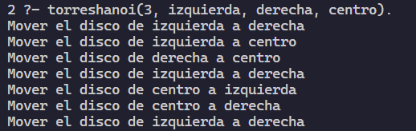

+++
date = '2026-05-23T21:05:22-07:00'
draft = false
title = 'Practica4'
+++ <br>
**Universidad Autonoma de Baja California** <br>
**Materia**: Paradigmas de la programacion <br>
**Docente**: Jose Carlos Gallegos Mariscal <br>
**Alumno**: Zazueta Medrano Aidan <br>
**Matricula**: 379479
# <center>Practica 4: Paradigma Lógico</center>

## Introducción
En esta practica, exploramos las funcionalidades que nos ofrece el paradigma lógico, en este caso utilizamos el lenguaje de programacion Prolog. En la practica desarrollamos la solución a dos problemas, por medio de recursividad y ademas de la asignacion de reglas y hechos.

> La programación lógica es un paradigma declarativo donde el código describe qué problema resolver mediante reglas y hechos matemáticos, en lugar de detallar el cómo paso a paso

## Problema de Torres de Hanoi
```prolog
torreshanoi(1, X, Y, _) :- 
    write("Mover el disco de "), 
    write(X), 
    write(" a "), 
    write(Y), 
    nl.

torreshanoi(N, X, Y, Z) :- 
    N > 1,
    M is N - 1,
    torreshanoi(M, X, Z, Y),
    torreshanoi(1, X, Y, _),
    torreshanoi(M, Z, Y, X).
```

Implementamos dos reglas, la primera funciona como un caso base, y la segunda es la estructura principal de la solucion del problema.
### En la estructura
- N es el numero de discos
- X es la torre de origen
- Y es la torre destino
- Z es la torre auxiliar

### Caso base
Cuando solo hay un disco, movemos de X a Y e imprime el movimiento. El cuarto argumento se ignora porque no es necesario un auxiliar

### Caso recursivo
1. `torreshanoi(M, X, Z, Y)`: Mueve N - 1 discos de arriba de X a Z, usando Y como auxiliar
2. `torreshanoi(1, X, Y, _)`: Mueve el disco mas grande de X a Y
3. `torreshanoi(M, Z, Y, X)`: Mueve los N - 1 discos de Z a Y, usando X como auxiliar

### Ejecución


## Problema de la Banana y el Mono
```prolog
move(state(middle,onbox,middle,hasnot), % Estado inicial
    grasp,   % accion 
    state(middle,onbox,middle,has)). % Estado final

move(state(P,onfloor,P,H),   climb,   state(P,onbox,P,H)).

move(state(P1,onfloor,P1,H),   drag(P1,P2),   state(P2,onfloor,P2,H)).

move(state(P1,onfloor,B,H),   walk(P1,P2),   state(P2,onfloor,B,H)).

canget(state(_,_,_,has)). % Verifica si el mono tiene la banana

canget(State1) :- % Si no tiene la banana
    move(State1,_,State2), % Realiza una accion
    canget(State2). % Llamada recursiva en base al estado final
```
### Estados
- P es posicion del mono (puede ser middle, door)
- V e posicion vertical del mono (puede ser onfloor, onbox)
- B es posicion de la caja (puede ser middle, door)
- H ¿Tiene la banana? (puede ser has, hasnot)

### Acciones
- `grasp`: Agarrar la banana. Solo funcion si el mono esta encima de la caja y ambos en el centro. Cambia hasnot a has
- `climb`: Subirse a la caja. El mono sube a la caja si esta en el mismo lugar que ella. Cambia onfloor a onbox
- `drag`: Arrastrar la caja. El mono arrastra la caja de P1 a P2. Requiere estar en el suelo y en la misma posicion que la caja
- `walk`: El mono camina de P1 a P2. La caja B no se mueve. 

### Cangets
- `canget(state(_,_,_,has))`: Caso base en el que ya tiene la banana
- `canget(State1) :-`: Caso recursivo
- `move(State1,_,State2)`: Busca cualquier accion valida
- `canget(State2).`: Verifica desde el nuevo estado puede obtener la banana

### Ejemplo (Flujo)
Para una consulta `canget(state(door, onfloor, middle, hasnot))`:
1. `walk(door, middle)` se mueve al centro
2. `drag(middle, middle)` ya estan juntos, no es necesario
3. `climb` el mono sube a la caja
4. `grasp` el mono ya puede tomar la banana

## Conclusión
El paradigma lógico parecia ser mas complejo en un inicio, pero a medida que vas familiarizando con su sintaxis es mas facil de entender. Los desarrollo de la solucion de los problemas planteados ayuda a comprender de una excelente manera cual es la utilidad de este paradigma.